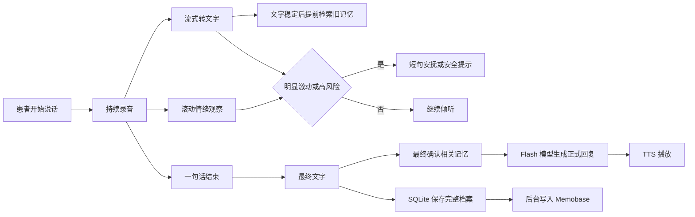

# 实时陪伴与长期记忆改造方案

## 1. 目标

患者说话时，系统同时完成收音、实时文字、情绪观察和长期记忆检索。患者停下后，只做最终确认并快速生成正式回复，减少等待。

系统必须满足：

1. 患者说话期间的完整音频、最终文字和完整情绪分析不能因系统插话而中断。
2. 长期记忆检索必须进入正式回复，不能因“慢”被普通超时直接跳过。
3. 会话只在用户/医护点击结束，或连接确实断开时结束；静默不结束会话。
4. Memobase、PostgreSQL、Redis 在本机运行；模型通过已配置的阿里云 API 调用，不使用 Memobase 云端或 Ollama。

## 2. 总体流程

这里的“一句话结束”只表示患者短暂停顿，可以生成一次回复；不表示当天聊天结束。

## 3. 患者说话时的四条工作线

### 3.1 持续录音

- 原始音频持续保存到当前语音片段的缓冲区。
- VAD 继续负责识别患者是否正在说话，以及一句话是否结束。
- 即时安抚、正常回复被打断、情绪检测失败，都不能停止这条录音链路。

### 3.2 流式转文字

当前火山 BigASR 是患者说完后一次性上传完整音频。改造后：

1. VAD 首次确认患者开口时，建立一条 BigASR 流式连接。
2. 每约 200ms 将新音频送入该连接。
3. 服务端返回的暂时文字实时发给前端显示。
4. VAD 判断一句话结束后，结束本次流式识别，拿到最终文字。

暂时文字用于屏幕展示、提前检索和即时风险观察；只有最终文字用于正式落库、正式回复和最终记忆检索。

### 3.3 滚动情绪观察

Emotion2Vec 现有调用方式需要一段完整音频，不能直接变成真正有内部状态的流式模型。因此使用滚动窗口：

- 默认每 0.8 秒检查一次最近 3 秒音频，并结合当前暂时文字判断情绪。
- 同一时刻只允许一个情绪推理任务。若新的窗口已经出现，旧结果即使稍后完成也直接丢弃，不再影响判断。
- 不强行杀死正在运行的推理线程。Python 线程和推理运行时通常无法安全中断，正确做法是“不排队旧任务，只使用最新结果”。
- 患者说完后，仍对完整音频运行一次现有的多模态情绪分析，作为最终记录。

`0.8 秒`、`3 秒` 只是首轮参数。必须先测量 Emotion2Vec 实际推理耗时；若单次推理超过 0.8 秒，采样间隔应改为略大于实际耗时，避免任务堆积。

### 3.4 提前检索长期记忆

当暂时文字同时满足下列条件时，开始找旧记忆：

1. 当前文字至少 5 个字。
2. 最近 1 秒的文字改动不超过 2 个字符。

系统保留最近 3 秒的文字历史。新文字与上次检索文字的编辑距离不超过 3 时，不重复查询；变化明显时发起新版查询，并给查询编号。旧查询返回后，如果编号已过期，结果直接忽略。

患者说完后：

- 最终文字与最新检索文字足够接近时，等待该检索完成。
- 差异明显时，以最终文字重新检索。
- 正式回复必须使用最终有效检索结果。

快速回复路径只使用患者稳定资料和直接找回的相关事件，不在这一步额外运行耗时的长期画像 LLM 筛选。Memobase 服务不可用时才降级为本地 SQLite 的有限记忆和本会话摘要；不能把“检索慢”当作服务不可用。

## 4. 即时安抚与鼓励

即时安抚只在患者仍在说话时使用，不是“先敷衍一句、之后再补一段完整答案”。它不调用大模型，使用审核过的固定短句。

### 4.1 触发条件

满足任一条件即可进入候选状态：

| 类型 | 初始规则 |
| --- | --- |
| 高风险表达 | 当前暂时文字出现“自杀、想死、不想活、结束生命”等明确表达 |
| 强烈悲伤 | `sadness >= 0.80` |
| 强烈愤怒 | `anger >= 0.70` |
| 强烈恐惧 | `fear >= 0.75` |
| 持续担忧 | `sadness >= 0.60`、`anger >= 0.50` 或 `fear >= 0.50` 连续两次出现 |

高风险表达优先级最高，立即播放固定安全提示，并将本会话标为高风险，供正式回复和后续人工处置使用。关键词只负责尽早提醒，最终记录仍以最终文字和完整情绪结果为准。

### 4.2 约束

- 两次普通即时安抚至少间隔 10 秒。
- 每次即时播报最多两句；每个会话最多两次普通即时安抚。
- 强烈正面情绪可使用鼓励短句，但与普通安抚共用次数上限，避免系统频繁插嘴。
- 高风险安全提示不受普通安抚次数上限限制，但同一风险状态不得反复播放。
- 患者一旦继续讲话，录音、文字、情绪和记忆检索继续运行。

### 4.3 初始话术

| 场景 | 话术 |
| --- | --- |
| 高风险 | 听到您这样说，我很担心您现在的安全。请先不要独处，找一位您信任的人陪在身边。 |
| 强烈悲伤 | 我在听，您慢慢说。 |
| 强烈愤怒 | 我听见您很难受，我在听。 |
| 强烈恐惧 | 慢慢来，我陪着您。 |
| 持续悲伤 | 我在听，您继续说。 |
| 强烈正面情绪 | 这很不容易，您做得很好。 |

安全话术不能说“您是安全的”，因为系统无法知道患者是否真的安全。

## 5. 音频播放与回声处理

即时安抚按正常音量播放，不暂停录音。为避免系统把自己的声音当成患者说话：

1. 前端采集麦克风时开启 `echoCancellation`、`noiseSuppression` 和 `autoGainControl`。
2. 后端保存最近 10 秒已播放的 TTS 文本。ASR 暂时文字与其高度相似时，标为可疑回声，不触发患者意图、情绪安抚或正式回复。
3. 回声判断不能只凭一次相似度直接丢弃完整语音，需结合 TTS 正在播放、文字相似度和语音持续时间一起判断，避免患者复述系统的话时被误删。

现有 TTS 是单路输出。需要增加统一播报调度：

- 患者讲话期间只允许即时安抚或安全提示。
- 正式回复还未开始播放时，患者重新开口，立即取消该回复。
- 正式回复播放中患者开口，停止该回复并保留新录音。
- 同一时刻只能有一段系统音频播放，避免即时安抚和正式回复交错。

## 6. 一句话结束与一次会话结束

| 事件 | 判断方式 | 后续动作 |
| --- | --- | --- |
| 一句话结束 | VAD 发现约 0.4 秒静音 | 结束本次 ASR，确认记忆，生成正式回复 |
| 主动结束会话 | 用户或医护点击结束 | 播放结束语，封存会话，整理长期记忆并刷新 Memobase |
| 被动结束会话 | WebSocket 关闭或心跳确认连接已断开 | 静默封存、整理、刷新 Memobase |

静默 2 分钟不能被当成会话结束。心跳只用于发现“连接确实已断开”，不是“患者暂时没说话”的计时器。

### 6.1 主动结束

1. 播报“我们这次就先聊到这里”。
2. 封存当前会话，禁止再向其写入新轮次。
3. 后台使用 `qwen-plus` 做本次会话的高质量长期整理。
4. 强制刷新 Memobase；失败内容留在 SQLite outbox，服务恢复后补发。
5. 连接保留当前患者身份，进入“等待下次开口”状态。

### 6.2 断连与下次开口

- 断连时不播报结束语，后台执行同样的封存和强制刷新。
- `beforeunload` 只作为尽力通知，不能依赖它；服务端检测到 WebSocket 断开才是可靠兜底。
- 同一连接中，患者下次开口自动创建新会话，不要求再发 `start_session`。
- 浏览器重新连接后，前端仍需在建连时携带患者身份；这是自动创建到正确患者名下的必要信息，但不需要患者再次点击“开始聊天”。

## 7. 模型分工

| 用途 | 模型 | 说明 |
| --- | --- | --- |
| 正式回复 | `qwen3.7-flash` | 默认候选，作为低延迟陪伴回复模型 |
| 会话结束后的长期整理 | `qwen-plus` | 不在患者等待回复的链路中使用 |
| 长期记忆向量检索 | `text-embedding-v4` | 仅用于找到相关旧事，不生成回复 |

正式回复模型先以 `qwen3.7-flash` 为默认值。若基准测试显示 `qwen3.6-flash` 或 `qwen-flash` 在心理陪伴质量相当且首句更快，则以实测结果替换。模型配置沿用项目现有的环境变量/配置入口，不为两个常量新建无必要的配置模块。

## 8. 基准测试与验收

在改造前，先运行或补充 `benchmark_latency.py`，记录：

1. Emotion2Vec 单次推理耗时，决定滚动检查间隔和音频窗口。
2. Memobase 直接事件检索耗时，确认提前检索能隐藏多少等待。
3. 三个 Flash 模型的首字延迟、完整回复耗时和人工质量评分。
4. 火山流式 ASR 的首个暂时文字时间、最终文字时间和最终文字修订幅度。

实施后验收：

1. 患者说话时，屏幕持续看到暂时文字；停止后得到最终文字。
2. 正式回复包含与当前话题相关的长期旧事，不因普通超时丢弃检索。
3. 患者说话中触发安抚时，完整音频、最终文字和最终情绪记录仍完整。
4. 患者打断系统时，旧正式回复不会继续播放，新语音会完整进入处理。
5. 主动结束和断连都能刷新 Memobase；下次开口创建新会话并加载同一患者的长期记忆。
6. Memobase 不可用时，SQLite 落库和正常对话继续，待恢复后自动补发。

## 9. 实施顺序

1. 先完成基准测试，确定真实延迟和初始参数。
2. 改造火山 ASR 为流式输入、暂时文字输出和最终文字确认。
3. 增加滚动情绪观察与即时安抚调度，先以保守阈值上线测试。
4. 增加基于稳定暂时文字的提前记忆检索，以及最终文字确认。
5. 替换正式回复为实测通过的 Flash 模型。
6. 补齐单路 TTS 调度、回声兜底、主动结束、断连刷新和自动新会话。
7. 用真实对话、打断、断连和跨会话记忆做端到端回归测试。

## 10. 故障处理原则

- 流式 ASR 连接异常：保留已经录到的完整音频，回退为当前的整段识别方式。
- Emotion2Vec 失败：跳过本次即时判断，不影响最终转写、正式回复和存档。
- Memobase 确认不可用：用本地有限记忆继续回复，并将待同步轮次放入 SQLite outbox；恢复后补发。
- 系统负载过高：优先关闭即时安抚和滚动情绪观察，保留录音、最终 ASR、正式记忆检索和存档。
