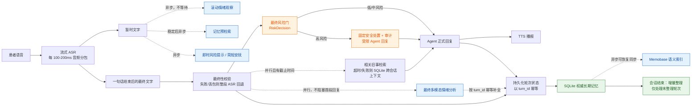
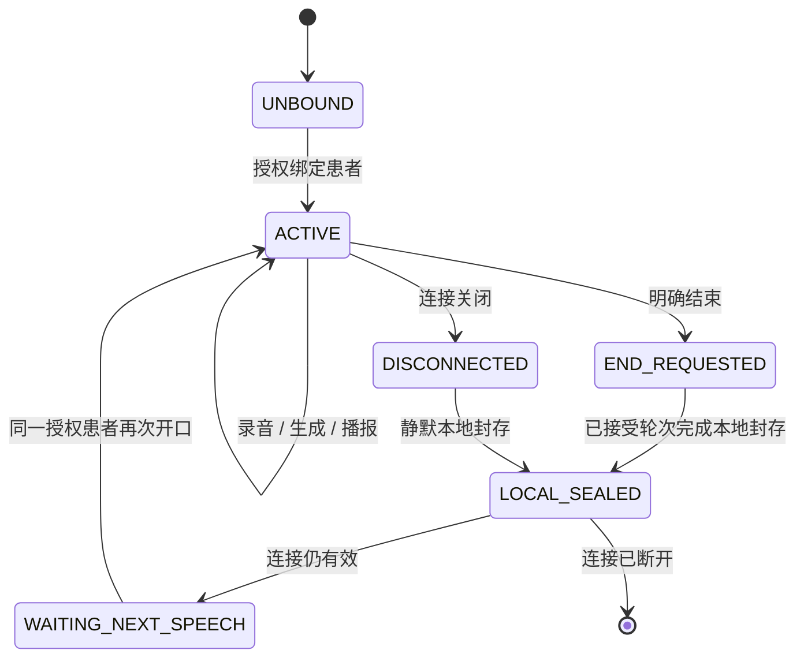

# 心理健康对话系统统一架构改造方案

> 状态：设计完成，待按本文实施与验收  
> 范围：针对主会话已定位问题的长期记忆统一、实时陪伴链路收口、安全兜底、患者权限、会话封存与验收  
> 核心决定：**只保留新的长期记忆系统；SQLite 是唯一事实源；Memobase 只做可恢复的语义检索副本。**
> 设计原则：安全门、持久化和授权必须由确定性代码保证；Agent、TTS 与外部检索只能在这些边界内工作。

## 1. 本方案逐项解决的问题

| 优先级 | 问题 | 修改方案 | 验收标准 |
| --- | --- | --- | --- |
| P0 | 最终完整文字没有独立高风险兜底。 | 暂时文字和最终文字复用规则版本；最终文字在正式回复前无条件通过风险门，命中时先执行固定安全处置并审计。 | 流式 ASR 失败、关闭或漏词时，完整文字命中风险仍触发安全处置；Agent 失败也不能阻止安全播报。 |
| P0 | 记忆 API 仅校验已登录，未校验该账号是否有权访问患者。 | 建立账号-患者分配关系；HTTP、WebSocket、会话恢复和 WebRTC 绑定共用患者授权校验。 | 普通账号不能读取、修改或绑定未分配患者；管理员可按角色访问全部患者。 |
| P1 | 新、旧长期记忆双写，来源不唯一。 | 新系统接管会话结束增量整理，删除旧管理器、兼容读写和旧表。 | 每个不可变轮次至多写入一次新记忆；运行时无旧表依赖。 |
| P1 | 人工修改只写 SQLite，Memobase 可能检索到旧事件。 | SQLite 记忆卡始终优先注入 Agent；人工修改不伪装成对话写入 Memobase，历史检索不能覆盖人工纠正。 | 编辑后下一轮立即使用新卡片；Memobase 返回相反旧事时，回复仍以人工卡片为准。 |
| P1 | 正式回复前置链串行等待，延迟相加。 | 最终 ASR 后并行执行最终风险、最终记忆检索和最终情绪；Agent 只等待有截止时间的安全门与最终记忆结果。 | 受控延迟测试显示总等待接近并行任务中较慢的一项，而不是两项相加。 |
| P1 | 最终多模态情绪尚未驱动 Agent 策略，且标签体系不同。 | 本轮明确延期，不直接替换 Agent 的 ASR 情绪输入。 | 情绪轨迹和 TTS 正常；无未经验证的回复行为变化。 |
| P2 | 会话开始未稳定加载完整权威记忆卡。 | 会话开始加载限长 SQLite 卡片；Memobase 只补充本轮相关旧事。 | 首轮回复可使用人工修改后的跨会话记忆。 |
| P2 | SQLite 回退重复拼接当前会话最近消息。 | 回退只提供跨会话长期记忆，当前会话仅由工作记忆提供。 | 最终上下文中近期消息只出现一次。 |
| P2 | 会话结束可能等待 Memobase 刷新，延迟进入下一会话。 | 本地封存后立即进入等待状态；Memobase 刷新和记忆整理走可恢复后台任务。 | 网络慢或 Memobase 不可用时仍能立刻进入下一次会话。 |
| P2 | 单元测试不能证明外部服务链路可用。 | 使用真实 BigASR、Emotion2Vec、Memobase 和登录态进行端到端验收。 | 取得完整时间线和断连/补发/打断的真实证据。 |

原问题清单中曾记录 `.env` 使用 `nostream`。当前配置已改为 `bigmodel_async`，但这只说明实时分支已打开，**不等于最终文字风险兜底已经存在，也不等于外部流式服务已验收**。

## 2. 已确认的现状

| 项目 | 已确认事实 | 结论 |
| --- | --- | --- |
| 新记忆写入 | 每轮完整对话已调用 `EmotionMemobase.capture_turn()`，写入快照、原始轮次和情绪轨迹。 | 保留并完善。 |
| 旧记忆写入 | 会话结束仍调用 `PatientMemoryManager.consolidate_session_async()`，写入 `patient_memory` 和 `patient_memory_sessions`。 | 必须替换。 |
| 旧兼容 | 新快照的 `narrative` 为空时仍读取旧 `patient_memory`；人工修改叙事时还会回写旧表。 | 必须删除。 |
| 旧表数据 | 当前工作区的 `data/voice_server.db` 中旧表和新表均为 0 行。 | 当前库不做内容迁移；每个部署库仍须在迁移前独立盘点并备份，不能外推。 |
| Memobase | 当前设计已是 SQLite 先落库、Memobase 异步镜像；Memobase 不可用时本地对话可继续。 | 保持该边界。 |
| 流式 ASR | `.env` 已配置 `ARK_ASR_MODE=bigmodel_async`。 | 配置已切换，但仍需真实 BigASR 验收。 |
| 高风险识别 | 实时暂时文字路径会触发安全提示；最终完整文字没有独立的兜底扫描。 | 必须补齐。 |
| 多模态情绪 | 最终情绪会更新记录和 TTS 语气；Agent 仍使用 ASR 的情绪标签。 | 本轮不改变 Agent 回答策略。 |

当前问题不是“两个长期记忆表”，而是**旧、新两套长期记忆实现同时运行**。只删除旧表会让会话结束调用报错；只保留旧表又会继续形成双写。因此必须先让新系统接管会话结束整理，再彻底删除旧实现和旧表。

## 3. 最终目标架构

### 3.0 不可变约束

1. **安全先于生成。** 所有正式最终文字，无论来自流式 ASR、整段回退、SoulX 或手工音频，均先得到确定性的 `RiskDecision`；高风险处置不依赖 Agent 是否可用。
2. **一轮一键。** 服务端在接受一句话时分配不可变 `turn_id`；同一 `(patient_id, session_id, turn_id)` 只能有一份原始轮次、一个情绪轨迹和一个外部同步源事件。
3. **本地先提交。** 录音、最终文字、最终/待补情绪和原始轮次先在 SQLite 事务中提交；TTS 打断、网络断连、Memobase 故障不得回滚已接受轮次。
4. **人工事实优先。** 人工修改是权威卡的显式修订，不是提示词偏好。被人工撤销或覆盖的历史证据不能再作为当前事实注入 Agent。
5. **授权在入口处执行。** 客户端传来的 `patient_id`、`session_id`、恢复请求和 WebRTC 控制通道均不可信；服务端必须先校验当前主体的患者级权限。
6. **外部服务永不阻塞封存。** Memobase 同步、LLM 整理和最终情绪是可恢复后台工作；本地封存完成后立即进入等待或断连状态。

### 3.1 三层记忆

| 层级 | 数据 | 生命周期 | 用途 | 是否事实源 |
| --- | --- | --- | --- | --- |
| 工作记忆 | 当前会话的最近对话、当前轮最终文字、会话状态 | 当前会话 | 维持本轮上下文和生成回复 | 否 |
| 长期记忆 | `emotion_memobase_snapshots`、`emotion_memobase_turns`、`emotion_trajectory`、`emotion_memobase_sync_state` | 跨会话 | 患者记忆卡、原始证据、情绪轨迹、同步进度 | **是，SQLite** |
| 语义检索层 | Memobase 中由原始轮次同步出的索引和事件摘要 | 可重建 | 按当前最终话语找相关旧事 | 否，只是副本 |

长期记忆内部不再额外建立一张“旧式会话详情表”。原始轮次已经是可追溯证据；会话结束时生成的是对权威记忆卡的**结构化增量补丁**，不是另一份独立叙事。`patients`、`sessions`、`messages`、MMSE 原始记录仍是既有业务事实；患者分配、安全事件和审计事件是安全域数据，不计入上述四张长期记忆表。

### 3.2 数据流



图中实线表示正式回复必须依赖的路径；虚线表示并行或异步路径。最终情绪先写入 `pending` 或 ASR 回退值，完成后按 `turn_id` 更新同一轨迹，不创建第二条轨迹。即时安抚、预检索和最终情绪分析都不能中断录音、最终 ASR、完整轮次保存和会话封存。

## 4. 新长期记忆的统一设计

### 4.1 表职责

| 表 | 物理字段与唯一约束 | 职责 |
| --- | --- | --- |
| `emotion_memobase_snapshots` | `patient_id`、`snapshot_json`、`revision INTEGER NOT NULL`、`last_consolidated_turn_id INTEGER NOT NULL`、`updated_at`、`updated_by`。 | 每位患者一张结构化、可人工编辑的权威卡；`revision` 用于 CAS 更新，整理水位只在合法补丁提交时推进。 |
| `emotion_memobase_turns` | 原有原始文字字段外，新增不可变 `turn_id`、`turn_state`、`response_status`；唯一 `(patient_id, session_id, turn_id)`。 | 保存患者原始证据与回复结果。重复投递返回已有行，绝不再次写轨迹、卡片或外部事件。 |
| `emotion_trajectory` | 新增 `turn_id`、`analysis_status`；唯一 `(patient_id, session_id, turn_id)`。 | 一轮只保留一条情绪轨迹，先记录 `pending`/ASR 回退结果，再按相同 `turn_id` 更新最终多模态结果。 |
| `emotion_memobase_sync_state` | `patient_id`、`last_synced_turn_id`、`attempt_count`、`next_retry_at`、`last_error`、`lease_until`、`updated_at`。 | 每位患者的可恢复同步游标和退避状态；不参与本地事实判断。 |

`revision`、整理水位、轮次唯一键和同步退避字段必须是列，不能藏在 JSON 或用时间戳推断。已有非空新表升级时，为历史行生成稳定 `turn_id=legacy:<id>`；当前工作区为空库无需内容迁移，但迁移程序仍须支持该安全升级路径。

权威卡内部的 `facts`、`preferences`、`events`、`comfort_strategies` 使用可追溯项：`id`、`text`、`source`（`manual` / `derived` / `legacy`）、`status`（`active` / `superseded`）与 `evidence_turn_ids`。人工更正必须标出其替代的派生项或证据轮次；构造检索上下文时过滤被替代的 `source_turn_id`。这不是“提示词优先”，而是数据选择规则。

安全域新增两张独立表，不与长期记忆混淆：

| 表 | 最小字段 | 约束 |
| --- | --- | --- |
| `safety_events` | `id`、`patient_id`、`session_id`、`turn_id`、`source`、`level`、`rule_version`、`text_hmac`、`status`、`created_at`、`handled_by`、`handled_at` | 不存原始患者文本；`(session_id, turn_id, rule_version)` 唯一，保证重试不重复发起事件。 |
| `patient_audit_events` | `id`、`actor_username`、`patient_id`、`action`、`object_revision`、`outcome`、`trace_id`、`created_at` | 记录编辑、授权、撤权、导出、删除、风险处置与迁移；不存记忆内容。 |

### 4.2 每轮保存

服务端在 VAD 确认一句话开始时分配 `turn_id`，并在最终文字通过“最终性校验”后立刻创建或更新该轮。轮次状态为：`CAPTURING -> FINAL_ASR -> DURABLY_CAPTURED -> SAFETY_GATED -> GENERATING -> RESPONDED | RESPONSE_CANCELLED`。只有首次插入会产生记忆和外部事件；后续状态更新只能更新同一行。

`DURABLY_CAPTURED` 事务必须完成以下事项：

1. 以 `(patient_id, session_id, turn_id)` 幂等写入患者最终文字、音频路径、ASR 完整性和初始 `response_status=pending`。
2. 以相同 `turn_id` 写入一条情绪轨迹，`analysis_status=pending`；情绪模型慢或失败时允许先填 ASR/规则回退值。
3. 更新快照中机械可得的最近轮次、最新情绪和时间，不在此处让 LLM 推断长期事实。
4. 记录本轮的 Memobase 同步候选；SQLite 提交后才允许后台投递。

Agent 生成完成后，仅更新该轮的 `assistant_message` 与 `response_status`。患者打断或连接断开时，已持久化的患者证据必须保留；未播出的助手内容标为 `cancelled`，不得进入后续工作记忆或被当成已送达回复。最终多模态情绪完成后按 `turn_id` 更新同一轨迹并标记 `final`，不得插入第二条记录。

本地提交成功即视为本轮成功保存。SQLite 事务失败时禁止继续把该轮标记为已封存或提交到 Memobase；Memobase 同步失败只能延迟，不得回滚 SQLite。

### 4.3 会话结束的增量整理

新系统需要新增 `EmotionMemobase.consolidate_pending_turns(...)` 或等价方法，替代旧 `PatientMemoryManager.consolidate_session_async()`。

执行规则：

1. 一个患者同时只允许一条可写的 `ACTIVE` 语音会话；第二个绑定请求必须拒绝或由管理员显式接管。这样单患者整理水位有明确语义。
2. 本地封存事务先记录 `cutoff_turn_id`，即该会话已持久化轮次的上界；晚到的新会话轮次不属于本次整理。
3. 读取 `last_consolidated_turn_id` 到该上界之间、状态可整理的原始轮次；不重新总结全部历史。
4. 读取权威快照与 `revision`，在数据库事务外请求 LLM 生成受限的结构化补丁。只接受白名单字段 `facts`、`preferences`、`events`、`comfort_strategies`、`narrative`；不得改写患者基础档案、MMSE 原始记录、原始轮次、情绪轨迹或手工项。
5. 校验补丁的 JSON 结构、长度、重复项和证据轮次。合法的空补丁可以推进水位；非法、超时或模型错误不写入也不推进，留待重试。
6. 在 SQLite 事务中以 `WHERE revision=? AND last_consolidated_turn_id=?` 做 CAS。成功时合并派生项、推进水位、递增版本并一次提交。
7. 若医护在 LLM 生成期间人工修改，放弃旧结果并基于最新快照重试一次；再次冲突则保留待整理状态。自动整理永远不能改写 `source=manual` 或 `status=superseded` 的项。

这保证增量更新可恢复且不覆盖人工修订。原始轮次保留到数据保留策略允许删除之前；它们是纠错依据，不是无期限默认保存承诺。

### 4.4 人工编辑优先级

人工编辑直接修改 SQLite 快照，并递增 `revision`。`PATCH` / `PUT` 必须携带 `expected_revision`；版本不一致返回 `409 MEMORY_REVISION_CONFLICT` 和当前版本，不做盲写。响应总是返回新的 `revision` 与可显示的卡片。

每次 Agent 生成前都注入限长 `authoritative_card`，其中只包含活动的权威事实；Memobase 结果只能放入单独的“未验证历史证据”区。上下文构造器必须按 `evidence_turn_ids` 过滤已被人工替代的事件，禁止把它们重新拼成当前事实。人工修改不伪装成患者说过的一轮对话，也不直接写入 Memobase；将来若要搜索人工记忆，另行设计带来源标识的索引更新。

### 4.5 Memobase 同步与恢复

Memobase 投递以本地 `source_turn_id` 做远端幂等键。若当前 SDK/服务不能按该键幂等 upsert，则该版本不能上线，不能用“本地水位看起来正确”替代远端去重。

后台工作器在启动、轮次提交和会话封存后唤醒，按患者串行读取 `last_synced_turn_id` 之后的轮次；一次失败只记录 `attempt_count`、`last_error` 和退避后的 `next_retry_at`，不阻塞会话状态。工作器用可过期 `lease_until` 防止多进程重复执行；进程在远端成功与本地水位提交之间退出时，重放由 `source_turn_id` 去重。同步任务仅在连续成功前缀后推进水位，部分成功从第一个未确认轮次继续。

## 5. 旧长期记忆系统的退出方案

### 5.1 不迁移数据，但必须清理调用链

当前工作区数据库的两个旧表均为 0 行，故此库不做内容转换。**这不是所有部署库为空的证明。** 任一目标库只要旧表非空，迁移命令必须中止并要求人工批准独立的数据处理方案，不能自动删除患者数据。

执行顺序：

1. 进入维护窗口，停止新的语音写入并确认当前会话已本地封存。
2. 记录绝对数据库路径、schema 版本和新旧表行数；用 SQLite backup API 或 `VACUUM INTO` 生成一致性备份。WAL 模式下不得只复制 `.db` 主文件。
3. 部署已完成新整理、轮次幂等和患者授权，但**不再创建或访问旧表**的候选版本；先跑迁移 dry-run 和全量回归。
4. 由单独的、可重跑的迁移命令通过 `PRAGMA user_version` 记录版本：升级新表列/索引、验证旧表为空、删除 `patient_memory_sessions` 后删除 `patient_memory`，最后写入成功版本。
5. 用空数据库和备份副本分别启动候选版本；确认 `init_db()` 不会重建旧表、完整会话只调用新整理。
6. 通过真实会话及回归后解除维护。回退只能恢复部署前备份并回滚程序版本；新版本不得长期保留旧读写兼容。

旧表删除必须是一次性、可审计迁移，不能藏在每次启动都会执行的初始化逻辑中。

### 5.2 涉及文件

| 文件 | 修改目标 |
| --- | --- |
| `src/context_management/emotion_memobase.py` | 删除旧叙事兼容；增加整理水位、版本控制、结构化增量整理和冲突处理。 |
| `src/voice/services.py` | `consolidate()` 改接新记忆系统；拆分权威卡与跨会话上下文，删除最近消息重复拼接和同步等待。 |
| `src/context_management/patient_memory.py` | 删除整个旧实现。 |
| `src/db/database.py` | 删除旧表 DDL、旧增删查函数和旧索引；增加版本化一次性迁移、患者分配与审计表。 |
| `src/web/memory_api.py`、`src/web/auth.py` | 增加 `expected_revision`、409 响应和统一患者授权。 |
| `src/voice/application.py`、`voice_server.py` | 把已认证主体传入语音生命周期，禁止客户端患者 ID 绕过授权。 |
| `src/voice/handlers/session_lifecycle_handler.py`、`session_resume_handler.py`、`src/voice/services.py` | 覆盖开始、绑定、恢复、结束和断连路径；封存后后台而非同步刷新。 |
| `src/voice/handlers/speech_turn_processor.py`、`realtime_companion.py`、中断/TTS 控制器 | 落实最终风险门、`turn_id/generation/playback_id` 和“取消播放但保留证据”。 |
| `tests/agents/test_patient_memory.py`、语音/API 相关测试 | 删除旧断言，新增迁移、水位、冲突、重试、授权、最终风险、打断和旧表删除后的启动回归。 |

## 6. 其他问题的修改方案

### 6.1 最终文本高风险兜底

当前实时分支可根据暂时文字设置 `high_risk_detected` 并发出安全提示，但暂时文字可能漏词或被流式 ASR 修正。抽取无网络依赖、版本化的风险规则，返回：

```text
RiskDecision = {
  level: low | medium | high | unknown,
  matched_rule_ids: [...],
  rule_version: "...",
  source: partial | final | fallback_final,
  final_text_hmac: "...",
  decided_at: "..."
}
```

- 暂时文字仅可提前发出一次固定安全提示或最多两句安抚，不能代替最终判断。
- 所有最终文字来源都必须无条件扫描：流式服务确认的 final、流式队列异常后的整段 ASR 回退、SoulX 最终文字、手工上传音频。流式只有收到服务端 final 且未发生丢包/错误时才可采信；否则整段回退识别后再过风险门，不能把最后一段 partial 当作 final。
- `low` 可走普通正式回复；`medium` 只增加受限的安全关怀指令与审计，不触发紧急播报；`high` 与 `unknown` 不允许无限制生成。规则阈值、脚本版本和本地化配置须由临床/运营责任人审核，不能由模型临场决定。
- `high` 时，先持久化不含原文的安全事件（患者、会话、轮次、来源、规则版本、带服务端密钥的文本 HMAC、时间、处置状态），再发送固定的本地化安全处置和 `safety_alert`。此动作不等待 Agent；Agent 只能生成受限的后续支持语，失败或超时不影响已经发出的固定处置。
- `unknown`（规则异常或超时）时，禁止放行无限制 Agent；记录 `risk_scan_failed`，使用不作诊断的受限安全回退并告警。风险规则应是轻量本地逻辑，截止时间来自基线测量并写入配置与日志。

最终文本扫描是正式回复的安全门，不依赖实时分支是否启用，也不依赖暂时文字是否出现过关键词。它是产品安全辅助，不替代人工危机处置或当地紧急服务。

### 6.2 患者权限

当前记忆 API 只要求“已登录”，不限制登录者是否有权访问路径中的患者 ID。采用管理员全量访问、普通账号显式患者分配的模型：

| 数据/接口 | 规则 |
| --- | --- |
| `patient_assignments` | `patient_id`、`username`、`can_read`、`can_write`、`can_voice`、`assigned_by`、`assigned_at`、`revoked_at`；`(patient_id, username)` 唯一并有患者、账号索引。分配、撤销和患者创建仅管理员可做，并写无内容审计事件。 |
| `authorize_patient(actor, patient_id, action)` | 唯一授权入口。管理员直接允许；普通账号只允许未撤销且对应 `can_*` 为真的分配。它在读取患者档案或记忆之前执行。 |
| HTTP 记忆 API | `GET` / context / trajectory 要 `read`，编辑、MMSE、安抚策略要 `write`。所有未授权或不存在的患者对普通账号返回同一 `403 PATIENT_ACCESS_DENIED`，不返回患者内容。 |
| 语音与恢复 | `start_session`、`prepare_patient`、`resume_session`、WebSocket 与 WebRTC 控制/媒体绑定都要 `voice`；恢复还必须校验该会话的 `patient_id` 与所属主体。客户端携带的患者/会话 ID 仅是请求参数。 |
| 公共 API key | 在没有显式服务账号和患者范围前，公共 key 不得访问患者记忆或语音绑定；默认拒绝，不能继承浏览器登录权限。 |

分配关系不得从历史会话或姓名推断。撤权在下一次请求、重连、绑定和恢复时立即生效；已建立的连接在下一次患者相关操作前重新检查。

### 6.3 会话开始和本地回退

将现有混合接口拆成三个有边界的方法：

1. `get_authoritative_card(patient_id)`：会话开始和每次正式生成都必定注入，限长但不因 Memobase 在线而省略；只含活动权威事实和人工修订。
2. `get_cross_session_context(patient_id, exclude_session_id)`：仅返回跨会话原始证据或本地摘要，永不拼入当前 `working_chat_history`。
3. `get_relevant_evidence(patient_id, final_text, exclude_session_id)`：优先查询 Memobase，超时或不可用则调用上一个方法；结果带来源标记，不能覆盖权威卡。

Agent 已持有当前会话 `working_chat_history`，任何 SQLite 回退不得再附加本会话最近消息。预检索只可作为候选；最终文字与预检索文本不满足规范化等价时必须重新检索，不能凭近似编辑距离复用错误证据。

### 6.4 并行与延迟控制

| 阶段 | 是否等待 | 规则 |
| --- | --- | --- |
| 流式 ASR 暂时文字 | 否 | 每 100-200ms 音频分包；用于界面显示和提前观察。 |
| 滚动情绪、预检索、即时安抚 | 否 | 携带 `turn_id/generation`；过期即取消或丢弃，不能阻塞录音、最终文字或本地落库。 |
| 最终文本风险扫描 | 是 | 轻量、确定性的安全门；有配置化 deadline。异常进入 `unknown` 受限回退，不能无限等待。 |
| 最终记忆检索 | 是 | 只接受最终文字确认的结果；有配置化 deadline，超时/失败立即使用 SQLite 跨会话上下文。 |
| 最终多模态情绪 | 否 | 与检索并行，先以 `pending`/回退值落库，完成后按 `turn_id` 更新轨迹；首段正式语音不等待它。 |
| Memobase 同步、会话增量整理 | 否 | SQLite 已封存后后台执行，可恢复重试。 |

“流式 ASR（200ms）”表示客户端把连续音频切成约 200 毫秒的小片段持续发送给识别服务，不是每 200ms 就结束一轮对话，也不是每个片段都要生成回复。

正式生成的开始时间满足：`t_agent_start - t_final <= max(t_risk_done - t_final, t_memory_ready - t_final) + orchestration_overhead`。具体 deadline 与 `orchestration_overhead` 上限由真实基线确定，不能以未测模型名或固定猜测值替代。

### 6.5 会话结束和断连

只有患者/医护明确结束或连接断开才结束会话；静默永远不是结束条件。会话状态机为：



| 事件 | 必须同步完成 | 可后台恢复 |
| --- | --- | --- |
| 患者新一轮开口 | 递增输出 generation、取消旧播放、为新轮分配 `turn_id`。 | 旧轮的最终 ASR、情绪补全和本地写入继续到可重试终态。 |
| 明确结束 | 停止接收新音频；取消普通回复；播报“我们这次就先聊到这里”（不写入患者对话历史）；对已接受音频发送 EOS 并完成本地封存。 | Memobase 刷新和增量整理。封存后立即发 `session_waiting_next_speech`。 |
| 断连 | 不播报、不向已关闭连接发送 waiting；将已接受音频交给脱离连接的本地封存任务。 | 同上，失败状态持久化，下一次有效连接按授权重新加载。 |

封存要先固定 `cutoff_turn_id`，再把同步和整理写入独立的后台待办；它不是会话状态，允许在 `WAITING_NEXT_SPEECH` 或连接关闭后继续。任何外部同步、LLM 整理或远端 flush 都不得延迟 `WAITING_NEXT_SPEECH`，也不得把旧任务的写入指向下一个会话。

### 6.6 打断与输出协议

所有服务端对前端的 `ai_response`、`ai_response_chunk`、`tts_start`、`tts_chunk`、`tts_end`、`stop_tts` 都必须携带 `session_id`、`turn_id`、`generation` 和 `playback_id`。前端只渲染当前 generation 的事件；服务端在发送前也做同样校验，不能把“前端会丢弃”当作唯一保护。

患者重新说话时只取消旧轮的生成输出和播放，不取消其已接受的录音、最终 ASR、情绪记录和 SQLite 保存。正式回复开始前取消排队中的安抚；正式回复或新一轮开口时取消仍在播放的安抚，并发送带原因的 `tts_end(reason=cancelled)`。所有 TTS 经过单一、可抢占的输出仲裁器：高风险固定处置优先，正式回复次之，短安抚最低；安抚只在强烈正/负情绪时触发、每次最多两句，不能因持有共享 TTS 锁拖慢正式首句。

## 7. 明确延期项

本次不修改 Agent 的显式情绪输入与标签映射。

原因不是该问题不存在，而是当前最终多模态情绪与 Agent 的情绪标签不是同一套语义：最终结果是七维分数，Agent 仍接收 ASR 的 `context.emotion`。现在强行替换会改变回复行为，需要单独定义标签映射、阈值、回退和临床验证标准。

本次完成后，最终多模态情绪仍用于情绪轨迹、长期记忆记录和 TTS 语气；后续再单独评估是否把它纳入 Agent 回复策略。

## 8. 分阶段实施顺序

| 阶段 | 工作 | 完成条件 |
| --- | --- | --- |
| 0. 基线、授权种子与备份 | 确认每个目标库路径、schema/表行数、管理员和患者分配；执行一致性备份并跑基线。 | 可恢复备份、授权种子、基线时间线和迁移 dry-run 均有证据。 |
| 1. 轮次与迁移底座 | 加入 `turn_id`、状态、唯一约束、轨迹幂等更新、快照版本/水位和可恢复同步状态；实现版本化迁移。 | 重复投递与进程重启均不会新增第二条轮次/轨迹；非空旧表自动中止。 |
| 2. 新记忆收口 | 实现权威卡、跨会话上下文、增量整理与人工修订冲突处理；让会话封存只调新整理。 | 人工项不被自动补丁或检索旧事覆盖；同步/整理不等待会话状态。 |
| 3. 旧系统退出 | 删除 `PatientMemoryManager`、旧兼容、DDL、CRUD、旧表和相关测试断言。 | 全仓运行路径无旧标识；空库和迁移副本均不重建旧表。 |
| 4. 授权与编辑契约 | 建立患者分配、统一 authorizer、会话/恢复校验和版本化记忆 API。 | 两个普通账号、管理员、撤权后重连和未知患者的矩阵全部通过。 |
| 5. 安全与实时协议 | 接入最终风险门、ASR 最终性回退、输出 generation、可抢占 TTS、结束/断连封存与情绪异步补全。 | 风险、打断、断连、队列满和慢情绪均满足本地保存与无旧输出。 |
| 6. 自动化与故障演练 | 补单元、集成、迁移、故障注入和浏览器/协议测试，记录无敏感内容指标。 | 通过第 9 节全部自动场景。 |
| 7. 真实服务验收 | 使用真实 BigASR、Emotion2Vec、Memobase、有效登录态和真实音频执行隔离环境端到端场景。 | 取得可审计时间线；未完成真实服务验收不得宣称生产就绪。 |

## 9. 验收清单

所有项目要同时给出断言、数据库证据和协议事件证据；“不报错”不构成验收。

| 场景 | 注入/操作 | 必须证明的结果 |
| --- | --- | --- |
| 新库与迁移 | 空库启动、含空旧表升级、含非空旧表升级。 | 新库不创建旧表；空旧表可删除；非空旧表停止并保留数据；备份可恢复。 |
| 轮次至多一次 | 对同一 `turn_id` 重传、在首次事务后强制重启、对同一轮重复封存。 | 原始轮次和情绪轨迹各一行；卡片和水位不重复推进；外部事件使用同一 `source_turn_id`。 |
| 人工修订竞态 | LLM 整理期间提交正确的 `expected_revision`，再提交过期版本。 | 前者保留，后者 409；自动补丁不能覆盖人工/已替代项；冲突旧证据不进入当前事实区。 |
| Memobase 部分失败 | 第 N 条远端写入后失败、超时、重启、恢复。 | waiting 不被阻塞；从未确认前缀继续；远端按 source key 至多一份事件；本地错误与下一次重试可观测。 |
| 最终风险门 | 关闭实时分支；仅 final/回退 final 含风险词；同时令 Agent 失败。 | 得到 `RiskDecision`、安全事件、固定安全处置；没有未受限正式生成。 |
| ASR 完整性 | 流式队列满、无 final 包、流式断开、整段回退成功。 | 不将 partial 当 final；回退文本仍过风险门且以同一 `turn_id` 保存。 |
| 授权矩阵 | 未登录、未分配用户、已分配用户、管理员、撤权后重连、未知患者。 | 所有 HTTP 记忆路由、开始、绑定、恢复和 WebRTC 控制/媒体通道都符合 scope；无患者内容泄露。 |
| 打断与播报 | 新语音分别发生在旧回复生成中、第一段正式 TTS 中、安抚 TTS 中。 | 已接受患者证据最终落库一次；旧 generation 后无 `ai_response_chunk` / `tts_chunk`；正确发送取消结束事件。 |
| 结束与断连 | 明确结束、断连、两分钟静默、同一患者下次开口。 | 静默不结束；结束语不进对话历史；本地封存后才等待/断开；外部同步未完成不阻塞；新会话只创建一次。 |
| 慢情绪与性能 | 永久挂起 Memobase、慢最终情绪、真实服务。 | 首段正式语音只等待风险和检索 deadline；轨迹最终只有一条且来源可追溯；记录完整时间线。 |

真实服务验收应记录同一 `trace_id` 下的：首个暂时文字、即时安抚、最终文字、风险决定、记忆检索开始/结束/回退、首段正式语音、SQLite 提交、会话封存、同步与整理完成。日志只记录 ID、耗时和结果码，不记录原始音频或患者文本。

## 10. 数据保护与可观测性

心理健康对话、情绪轨迹、音频路径和记忆卡均为敏感数据。上线前必须由数据所有者确定保留期限、访问审计保留期、导出/删除流程和适用地域的人工危机处置流程；当前方案不把“原始轮次永久保留”当作默认合规策略。

- 原始音频、转写、记忆卡和 SQLite 备份采用受控存储与最小权限；日志、指标、异常上报不得包含原文、音频或可逆患者资料。
- 编辑、分配、撤权、导出、删除、风险处置和迁移都写无内容审计事件：操作者、患者、动作、对象版本、结果、时间与 `trace_id`。
- 删除/脱敏从 SQLite 权威数据开始，并对 Memobase 副本执行可重试的级联删除；未确认远端删除前保留删除待办状态，不把本地删除误报为全链路完成。
- 指标至少覆盖：风险门结果/异常、ASR final 回退、轮次重复抑制、过期输出丢弃、同步积压、整理冲突、授权拒绝和各阶段耗时。指标只能使用匿名/内部 ID。

## 11. 风险与回退

| 风险 | 处理 |
| --- | --- |
| LLM 整理输出错误或不可解析 | 不写入补丁，不推进整理水位；保留原始轮次后续重试。 |
| 人工修改与后台整理冲突 | 用 `revision` 检测；重新基于最新快照生成，仍冲突则延期。 |
| 删除旧表后需要回退 | 恢复一致性 SQLite 备份和上一版程序；不在新版本保留旧兼容逻辑。 |
| Memobase 故障或崩溃窗口重放 | 使用 SQLite 权威卡；水位不越过未确认前缀；远端用 `source_turn_id` 去重后补发。 |
| 风险规则异常 | 记录扫描失败，禁止无限制 Agent，进入受限安全回退并告警。 |
| 外部模型延迟超标 | 先关闭即时安抚/预检索等可选路径，保留录音、最终 ASR、风险门、SQLite 回退、正式记忆检索和本地保存。 |
| 授权配置错误 | 默认拒绝患者数据访问；仅管理员可修复分配，不以历史会话自动补权。 |

## 12. 架构图更新规则

后续架构图统一采用以下表达，避免把并行、异步和正式依赖画混：

- 绿色实线框：SQLite 权威数据和正式必须完成的路径。
- 蓝色虚线框/线：异步或并行工作，不阻塞正式回复。
- 橙色框：安全门和高风险处置。
- 灰色虚线框：已废弃的旧记忆系统，仅在“迁移前现状图”中出现；最终图不保留。
- 不在图中写 `create_task`、`to_thread` 等代码实现术语，只写业务含义，例如“后台异步处理”“并行分析”“结果过期丢弃”。

最终架构图保留四张长期记忆表、患者授权/安全审计边界和 Memobase 副本，不再出现旧长期记忆表、旧会话详情表或旧记忆管理器。
