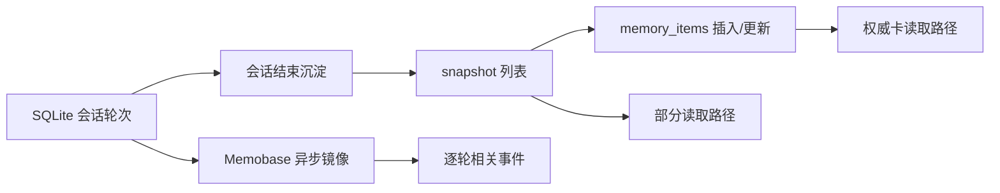
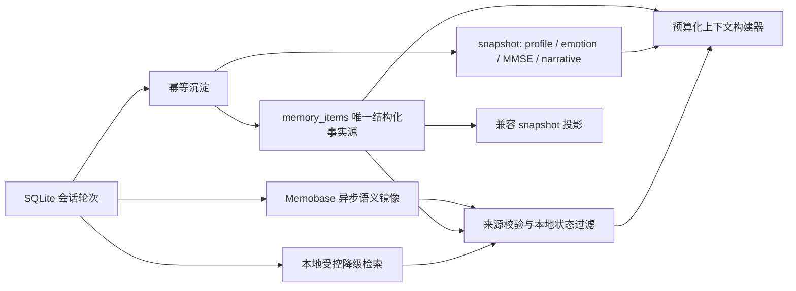

# 长期记忆引擎修复与情感陪伴增强修改方案

> 状态：待确认，未实施  
> 日期：2026-08-13  
> 依据：当前源码审查、最小复现和相关测试结果（146 passed）

## 1. 结论

本轮不推翻现有技术栈。继续使用：

- **SQLite：本地权威状态和可恢复队列**；
- **Memobase：可丢失、可重建的异步语义镜像**；
- **会话结束或断连时整理/同步**，普通轮次的 Memobase 同步时机保持不变。

首要修改不是增加召回数量，而是消除确定性错误：漏记、旧事实复活、无效策略被误用、无证据情绪被伪造、停止使用的内容被远端结果带回。只有这些不变量建立后，才启用更强的情感抽取和本地召回降级。

核心架构调整为：

> **`memory_items` 是结构化长期记忆的唯一事实源；snapshot 不再保存可独立修改的 facts、preferences、events、comfort strategies。**

snapshot 继续保存 profile、MMSE、情绪摘要/历史、narrative、revision 和迁移兼容投影。兼容投影只能由 `memory_items` 生成，不能反向成为第二套权威状态。

## 2. 范围边界

### 2.1 本轮明确冻结

按照上一轮缺点编号，以下三项先不动：

1. **缺点 1**：不改变普通轮次写入 Memobase 的时机；仍在明确结束或断连后同步。
2. **缺点 11**：不补齐文字输入路径的逐轮长期语义检索。
3. **缺点 14**：不建设患者级记忆同意、分类授权、撤回、保留期和全链路物理擦除。

边界说明：本方案会修复“纠错或停止使用后仍被用于回复”的一致性问题，但这只是**逻辑失效和远端尽力清理**，不是缺点 14 所指的全链路彻底擦除。

### 2.2 本轮纳入

| 编号 | 缺陷 | 目标结果 |
|---|---|---|
| D01 | 乱序结束会话会漏记 | 每个合格轮次恰好完成一次可幂等沉淀，不依赖患者级全局水位 |
| D02 | 整体修订后旧 active item 残留 | 结构化记忆只有一个权威状态，替换后旧项立即失效 |
| D03 | 最新高价值记忆被截掉 | 先排序和分配预算，再组装上下文；高优先级新记忆不会因位置丢失 |
| D04 | 无效安抚策略被标成有效 | 明确保留有效性，并分开渲染“有效策略”和“应避免方式” |
| D05 | 无情绪证据时产生伪 calm/唤醒值 | 缺证据显式为 `unavailable`，不生成可供陪伴决策使用的伪分数 |
| D06 | 情感记忆抽取过弱 | 在会话沉淀阶段引入受约束结构化抽取和候选确认机制 |
| D07 | 情绪轨迹未进入语音陪伴上下文 | 只注入新鲜、可解释的趋势摘要，不把历史情绪当作当前诊断 |
| D08 | Memobase 故障时跨会话事件断层 | 远端失败时启用有界、本地、可追踪来源的降级检索 |
| D09 | 编辑/停止使用后的远端一致性不可靠 | 本地读取立即生效，远端失效操作可重试，延迟补发前复核状态 |
| D10 | 前端修订契约和交互不完整 | 支持 revision/version、逐项修订、确认候选和“停止用于陪伴” |

### 2.3 不采用的伪修复

- 不靠盲目增大 `top_k`、降低相似度阈值或增大 prompt 字符数掩盖问题。
- 不新增向量数据库。
- 不更换 Memobase。
- 不建立庞大人物关系图谱或通用知识图谱。
- 不让模型自行给出的 confidence 直接决定高敏记忆是否启用。

## 3. 当前与目标架构

### 3.1 当前关键问题

当前 snapshot 列表和 `memory_items` 都能影响运行结果，形成双事实源：



snapshot 删除一个旧项时，`memory_items` 不一定同步失效；远端结果也没有统一经过本地权威状态复核。

### 3.2 目标结构



必须始终成立的四个不变量：

1. `candidate`、`superseded`、`deleted`、`blocked` 不能进入陪伴 prompt。
2. 远端命中没有可验证的 `patient_id` 和来源标识时，不进入 prompt。
3. 同一 `slot_key` 在同一有效时间范围内最多一个 active item。
4. 上下文超预算时按优先级舍弃，不按字符串位置粗暴截断。

## 4. 数据模型

### 4.1 `memory_items` 扩展

保留现有主键、患者、类别、内容、来源、版本、状态和时间字段，增加以下最小字段：

| 字段 | 用途 | 规则 |
|---|---|---|
| `slot_key` | 表示“当前年龄”“当前住址”“称呼偏好”等可替换槽位 | append-only 事件可为空；同槽冲突走替代关系 |
| `observed_at` | 事实/事件发生或被观察时间 | 与写入时间分开，避免把旧事当当前情况 |
| `valid_until` | 当前事实或短期状态的失效时间 | 过期后不能作为当前事实注入 |
| `confidence` | 证据强度 | 0-1；只作排序和候选判断，不能覆盖来源权限规则 |
| `sensitivity` | `normal` / `sensitive` / `high` | 本轮只控制自动启用和注入，不扩展为患者同意系统 |
| `confirmed_by` | 用户或医护确认者标识 | 未确认为空；审计日志不记录记忆正文 |
| `supersedes_item_id` | 明确记录替代的旧 item | 替代和新建必须在同一事务完成 |
| `metadata_json` | 少量类别特有属性 | 仅放 `effective`、使用次数、适用情境等，禁止变成无约束数据垃圾桶 |

现有 `source` 字段直接收敛为明确枚举，不再新增含义重复的 `source_type`：

```text
user_direct
user_correction
clinician_confirmed
system_inferred
legacy_migrated
```

状态收敛为：

```text
candidate   待确认，不注入
active      当前允许用于陪伴
superseded  已被新版本替代，不注入
deleted     已停止使用，不注入；当前仍是软删除
blocked     因安全或策略限制禁止注入
```

来源优先级不能一刀切：

- 感受、偏好、称呼和边界：用户当前纠正 > 用户直接表达 > 医护记录 > 系统推断；
- 医疗或管理事实：医护确认 > 用户当前纠正 > 用户历史表达 > 系统推断；
- 系统推断永远不能静默覆盖任何明确表达。

### 4.2 轮次沉淀状态

在本地轮次表增加：

```text
consolidation_status: pending | consolidated | skipped
consolidated_at
```

不用患者级 `last_consolidated_turn_id` 决定某轮是否处理。旧水位只保留为迁移兼容和诊断字段，运行时查询以逐轮状态为准。

失败的抽取不标记为 consolidated；`CANCELLED`、`FAILED` 等不合格轮次可明确标记 skipped。这样重启后只需重试 pending。

### 4.3 远端失效队列

增加小型 SQLite 表 `memory_mirror_ops`，只处理 edit/supersede/delete 造成的远端失效，不承担普通轮次同步：

```text
op_id, patient_id, item_id, item_version, op_type,
source_turn_id, content_hash, status,
attempt_count, next_retry_at, last_error, created_at, updated_at
```

使用现有重试、退避和 lease 思路，不增加消息队列或后台基础设施。

## 5. 改造包 A：确定性一致性

### A1. 修复乱序沉淀

主要入口：

- `src/context_management/emotion_memobase.py::_pending_consolidation_turns`
- `src/context_management/emotion_memobase.py::consolidate_pending_turns`
- `src/voice/services.py` 中会话结束沉淀调用

新流程：

1. 按 `patient_id + session_id + consolidation_status=pending + cutoff` 读取明确的 turn id 集合。
2. 在事务外完成结构化抽取，避免长事务阻塞语音写入。
3. 开启 `BEGIN IMMEDIATE`，重新确认这些 turn 仍为 pending，并检查 snapshot revision。
4. 在同一事务内写入/替代 items、更新非 item snapshot、把成功轮次标记 consolidated。
5. revision 冲突时重新读取并重算合并，最多重试 3 次；仍冲突则保留 pending 并显式报错，不能前移水位。

并发语义：两个会话可同时做抽取，但提交阶段串行；后提交者基于最新 revision 重新合并。新会话先结束不会越过旧会话。

### A2. 消除 snapshot/item 双事实源

主要入口：

- `emotion_memobase.py::_sync_memory_items_from_snapshot`
- `emotion_memobase.py::update_memory_by_user`
- `emotion_memobase.py::get_authoritative_card`
- `emotion_memobase.py::get_context_for_llm`

修改原则：

- 新写路径直接对 `memory_items` 做新增、替代、停止使用，不再用 snapshot 列表驱动 item。
- `_sync_memory_items_from_snapshot` 仅保留为一次性迁移函数，迁移完成后不得在正常写路径调用。
- 旧整块 PATCH 接口作为兼容适配器：按 item id 做 diff，新增项 insert，改写项 supersede+insert，移除项标记 deleted；全部共用一个 revision 事务。
- profile 的清空使用显式 `null`，区分“字段未提交”和“请求清空”，不能继续忽略空值导致无法清除。

### A3. 修复策略和情绪语义

主要入口：

- `emotion_memobase.py::add_comfort_strategy`
- `emotion_memobase.py::_sync_memory_items_from_snapshot`（迁移逻辑）
- `emotion_memobase.py::_normalise_emotion`、`_dominant_emotion`、`_classify_emotion`
- `emotion_memobase.py::update_emotion_analysis`

安抚策略把 `effective` 写入 `metadata_json`：

- `effective=true`：可进入“已验证有效的安抚方式”；
- `effective=false`：只能进入“应避免的方式”；
- 未知：保持 candidate，不得猜成 true。

情绪分类没有可用证据时：

- 返回 `analysis_status=unavailable`、`dominant=unknown`；
- 不生成均匀概率，不把 unknown 转成 calm；
- 如果为审计保留 trajectory 行，分数可用占位值，但所有读取必须先过滤 `analysis_status=final`；
- 趋势、唤醒触发和陪伴 prompt 只消费 final 行。

### A4. 修订/停止使用立即生效

主要入口：

- `emotion_memobase.py::update_memory_item`
- `emotion_memobase.py::delete_memory_item`
- `emotion_memobase.py::_replay_unsynced_impl`
- Memobase 相关删除和检索函数

本地提交必须原子完成：

1. 校验患者、item version 和调用者权限。
2. edit 采用旧 item `superseded` + 新 item `active`，不原地改写证据历史。
3. stop-use 将 item 设为 `deleted`，写 deletion audit 和远端失效队列。
4. API 返回后，本地所有卡片和检索立即过滤旧 item，不等待 Memobase 成功。

远端一致性采用“本地强一致、远端最终一致”：

- Memobase hit 必须回查本地 item/source turn 状态；命中已失效来源时丢弃。
- 延迟补发普通轮次前检查该 source turn 是否在失效集合中；存在 item 级失效而远端又无法做到片段级删除时，保守跳过该整个 source turn。
- `memory_mirror_ops` 重试远端删除；达到重试上限后进入 failed 状态并告警，但不恢复本地可见性。
- Memobase 结果缺少可验证 `source_turn_id` 时，不得用于个性化回复。

保守跳过整轮可能损失该轮中的其他有效事实，这是远端以整段对话为最小证据单位的代价。结构化 active items 仍可提供这些事实；不能为了提高召回而允许已停止内容复活。

## 6. 改造包 B：情感记忆语义

### B1. 受约束结构化抽取

主要入口：

- `emotion_memobase.py::_default_consolidation_patch`
- `emotion_memobase.py::_validate_consolidation_patch`
- `emotion_memobase.py::_merge_consolidation_patch`
- `src/voice/services.py` 的 `consolidate_pending_turns` 调用

复用项目现有模型/provider 抽象，在会话结束沉淀阶段提供 `patch_builder`。不为此增加新的模型 SDK。

第一版只扩展真正会改变陪伴回复的类别：

```text
facts
preferences
events
emotional_triggers
boundaries
comfort_strategies
```

关系、丧失经历和纪念日归入 facts/events；反复模式只有在有明确证据时才作为 fact。暂不建立关系图谱。

抽取输出必须满足固定 JSON schema：

```json
{
  "category": "boundaries",
  "content": "不希望被连续追问家庭冲突细节",
  "slot_key": "boundary:family_conflict_followup",
  "observed_at": "2026-08-13",
  "valid_until": null,
  "confidence": 0.96,
  "sensitivity": "sensitive",
  "source": "user_direct",
  "evidence_turn_ids": ["turn-17"],
  "metadata": {}
}
```

服务端必须验证类别、长度、时间、confidence 范围、来源轮次归属和证据原文；模型输出不能直接拼 SQL 或绕过状态规则。

### B2. candidate 与 active

自动启用规则：

- 低敏、用户直接明确表达、高置信、无冲突、证据轮次可追踪：允许直接 active。
- 高敏、系统推断、含冲突、时效不明或低置信：只保存 candidate。
- 边界类即使敏感，只要是用户当前直接表达，可以立即 active，因为继续违反边界的风险高于等待确认；必须保留原始证据和可撤销入口。
- 危机、创伤、诊断、家庭冲突等内容不得仅凭模型推断自动 active。

confidence 阈值需用抽取 oracle 校准；在没有评测数据前，不在代码里拍脑袋固化 0.8/0.9 等值。

### B3. 冲突、时效和危机记忆

- 有 `slot_key` 的当前事实发生冲突时，不覆盖原行；新建 item 并将旧项标记 superseded。
- 没有足够证据判断新旧时，两者都不作为“当前事实”使用，新项保持 candidate 并进入待确认列表。
- `valid_until` 已过的 item 不作为当前状态注入，可作为带日期的历史事件保留。
- 历史危机表达只能描述为“某日期曾表达……”，不得推断当前仍处于危机；当前风险必须由本轮安全链路重新判断。

## 7. 改造包 C：召回与上下文

### C1. 统一检索结果协议

`get_relevant_evidence` 不再直接返回不可校验的拼接文本，内部先形成结构化结果：

```text
item_id / source_turn_id
patient_id
category
content
observed_at
status
retrieval_source: authoritative | memobase | local_fallback
score
```

在渲染为 prompt 前统一执行：患者隔离、状态、时效、敏感性、当前会话排除、失效来源和最大条数检查。

### C2. 本地受控降级

触发条件仅限 Memobase unavailable、error 或 timeout，不与正常远端结果混排来扩大召回。

实现优先级：

1. active 结构化 items 数量有限时直接做有界字符 n-gram/关键词评分；
2. 若用户允许检索跨会话原文，再对“已完成且非当前会话”的轮次建立 SQLite FTS5 trigram 索引；
3. 不安装新搜索服务或向量数据库。

降级结果最多 3 条，必须带来源；检索不到就明确返回空，不能把最近若干条伪装成相关记忆。

### C3. 上下文预算化构建

重写 `emotion_memobase.py::get_authoritative_card` 的组装逻辑，并调整：

- `src/voice/services.py` 的长期卡加载；
- `src/agents/wellbeing_companion_agent.py::WellbeingMemoryTool` 的 4000 字符截断。

构建顺序：

1. 先过滤不可用 item；
2. 按当前纠正/边界/来源权威性、查询相关度、时效、新近性排序；
3. 为各类别保留预算并允许未用预算动态让渡；
4. 在总预算内完整组装条目；
5. 下游工具只接收已满足硬上限的结果，不再用 `value[:4000]` 二次破坏排序。

建议的初始预算不是永久常量，应由评测校准：

| 内容 | 初始预算（字符） | 优先规则 |
|---|---:|---|
| 当前纠正、边界、避免策略 | 600 | 不得被普通旧事实挤掉 |
| 基本信息与当前事实 | 650 | 当前有效、明确来源优先 |
| 查询相关事件/触发因素 | 1000 | 相关度后按 observed_at 排序 |
| 偏好与有效安抚策略 | 650 | 已确认有效优先 |
| 情绪趋势摘要 | 350 | 只用 final，必须含时间范围 |
| narrative 与格式余量 | 750 | narrative 最先压缩 |

总上限仍可保持约 4000 字符，但这 4000 字符由构建器按价值选择，而不是先拼旧内容再截断。

### C4. 情绪趋势进入陪伴上下文

语音链路加载权威卡时增加短趋势摘要：

- 只取最近有限个 `analysis_status=final` 的轨迹点；
- 标明时间窗口和最后观测时间；
- 可描述主导情绪、唤醒变化和反复触发因素；
- 不输出诊断，不把历史趋势写成当前情绪；
- 没有证据时整个趋势段省略或标为 unavailable，不写“平静”。

## 8. 改造包 D：用户纠错界面

### D1. API 契约

主要入口：`src/web/memory_api.py`

- 整体 PATCH 必须提交 `expected_revision`；冲突返回 409 和当前 revision。
- item update/confirm/stop-use 必须提交 `expected_version`；冲突返回 409 和当前 item。
- list item 返回来源类型、状态、版本、观测时间、有效期、确认者和是否存在证据；默认不返回不必要的完整敏感原文。
- 增加 candidate 的 confirm/reject 操作；reject 转为 blocked 或 deleted，不直接物理删除。
- “清空 profile 字段”使用显式 null 语义并纳入审计。

### D2. 前端行为

主要入口：`frontend/src/components/MemoryCard.vue`

- 首次加载保存 revision，整体保存时提交 `expected_revision`。
- 从整块 facts/preferences 文本框逐步切换为逐 item 编辑。
- 每项显示类别、状态、更新时间和简短来源；支持“纠正”“确认候选”“停止用于陪伴”。
- 当前按钮和提示统一使用“停止用于陪伴”，不能称为“彻底删除”。
- 409 时保留用户未提交内容，展示服务器新版本并要求重新确认，不静默覆盖。

前端实际实施后必须启动真实页面，至少验收桌面和移动宽度下的列表、编辑、409 冲突、candidate 确认、停止使用状态，并保存截图作为阶段证据。

## 9. 关键流程

### 9.1 会话结束沉淀

```text
读取本会话 pending 轮次
  -> 受约束抽取
  -> 服务端 schema/证据校验
  -> candidate/active 分类
  -> BEGIN IMMEDIATE + revision 复核
  -> item 新增/替代 + snapshot 非 item 更新
  -> 对应轮次 consolidated
  -> COMMIT
  -> 按现有时机触发普通 Memobase 同步
```

抽取失败时对话归档仍存在，轮次保持 pending；不能用空 patch 把它标成已成功处理。

### 9.2 逐轮检索

```text
查询 Memobase（现有超时）
  -> 成功：解析 provenance
  -> 失败/超时：可选本地降级
  -> 回查 SQLite 患者、item/source turn 状态
  -> 排除当前会话、失效、过期、未确认内容
  -> 0-3 条结构化证据
  -> 与权威卡一起预算化组装
```

### 9.3 用户纠正

```text
expected_version 校验
  -> 旧 item superseded
  -> 新 item active（source=user_correction）
  -> 写 audit + mirror invalidation op
  -> revision/version 更新
  -> 本地读取立即生效
  -> 后台尽力清理远端旧证据
```

### 9.4 停止用于陪伴

```text
expected_version + deletion_token 校验
  -> item deleted
  -> 写 deletion audit + mirror invalidation op
  -> 本地检索和 prompt 立即过滤
  -> 未同步补发检查 source turn
  -> 远端重试删除
```

此流程不承诺数据库备份、审计记录、Memobase 内部数据和其他下游副本的物理擦除。

## 10. 数据迁移与兼容

迁移采用 expand -> backfill -> switch-read -> contract，不直接破坏旧数据。

### 阶段 M1：扩展 schema

- 备份 SQLite 文件并记录 schema/version、行数和患者数。
- 添加 item 字段、逐轮 consolidation 状态、mirror ops 表和必要索引。
- 不删除 snapshot 旧列表和旧水位。

### 阶段 M2：幂等回填

- 按现有稳定 item id 优先、类别+规范化内容次之，将 snapshot 列表回填到 `memory_items`。
- 保留已存在的 deleted/superseded 状态，迁移不得把 tombstone 复活。
- 安抚策略迁移 `effective`；缺失值转 candidate，不能默认 true。
- 旧数据来源标为 `legacy_migrated`，不伪造 confirmed_by。
- 为已有合格历史轮次设置 consolidation 状态时，以现有沉淀证据和旧水位做保守推断；不能证明已沉淀的轮次保持 pending，由幂等规则去重。

### 阶段 M3：影子校验和切读

- 同时生成旧 snapshot 列表视图和新 item 视图，只比较差异，不双写两份权威状态。
- 验证无跨患者差异、无 tombstone 复活、策略有效性一致后，切换权威卡和 API 到 item 读取。
- 兼容 snapshot 列表改为由 item 单向生成的只读投影。

### 阶段 M4：收敛

- 所有消费者切换完成后，停止运行时调用 `_sync_memory_items_from_snapshot`。
- 本轮可保留旧字段以便回滚；确认至少一个发布周期稳定后，再单独决定是否删除兼容字段。

## 11. 实施顺序

| 阶段 | 内容 | 启用条件 |
|---|---|---|
| P0 | 固化缺陷复现、oracle 和迁移前基线 | 现有 146 项回归继续通过 |
| P1 | schema、逐轮沉淀、单事实源、策略/unknown 情绪、远端本地过滤 | D01/D02/D04/D05/D09 硬验收全部通过 |
| P2 | 预算化卡片、状态复核、本地降级、情绪趋势 | 检索与延迟门槛通过 |
| P3 | 受约束情感抽取，以 shadow/candidate 模式运行 | active 精度和敏感内容门槛通过 |
| P4 | 逐 item API 与前端纠错 | API 并发、真实页面和截图验收通过 |
| P5 | 小流量开启自动 active 与本地降级，完成配对盲评 | 安全、隔离、质量门槛均通过 |

P1 不依赖 P3；可以先把现有有限记忆做正确，再扩大抽取面。P3 在 P4 可确认界面可用前，不自动启用高敏 candidate。

## 12. 测试与评测

### 12.1 单元和并发测试

至少新增：

- 新会话先结束、旧会话后结束，两边都沉淀；
- 同一患者两会话交错 turn id；
- 两个 consolidator 并发，revision 冲突后正确重试，无重复 item；
- 80 岁纠正为 81 岁后只注入 81，旧 item 为 superseded；
- `effective=false` 只出现在“应避免”，未知不出现在任一可执行策略段；
- 空分类不生成 calm、均匀概率或非零可用 arousal；
- 最新高优先级 item 在总预算边界内仍保留；
- candidate/deleted/superseded/blocked/expired 全部不注入；
- 未同步 source turn 在停止使用后不会被补发；
- 远端失效失败、重启、退避、重试成功的状态机完整。

主要测试文件：

- `tests/test_memobase_basic.py`
- `tests/voice/test_voice_services.py`
- `tests/agents/test_wellbeing_memory_snapshot.py`
- memory API 对应测试文件（实施时按现有目录放置，不新建无意义测试框架）

### 12.2 检索 oracle

构建小而严格的人工标注集，覆盖：

- 害怕独处、睡眠诱因、丧失经历、边界、家庭关系冲突、纪念日反应、有效/无效安抚策略；
- 新旧事实冲突、临时事实过期、否定表达；
- 相似措辞但不同患者；
- 当前会话与跨会话重复；
- 历史危机事件和当前无危机的组合。

指标：Recall@1/3、关键记忆漏检率、无关注入率、失效事实使用率、跨患者错召回率。

### 12.3 抽取 oracle

逐 item 标注 category、content、slot、time、sensitivity、是否应 active。分别统计：

- 自动 active precision；
- active + candidate 的总体 recall；
- 冲突识别正确率；
- 高敏推断误激活数；
- 无证据虚构数。

### 12.4 真实服务与故障测试

- Memobase 正常、超时、断开和恢复；
- 服务在沉淀提交前、提交后、远端失效中途重启；
- S=1000 数据规模下卡片构建、本地降级和迁移耗时；
- API 并发修订和 409 恢复；
- 关闭长期记忆时不产生隐式读取或写入。

### 12.5 陪伴质量配对盲评

同一组多轮场景分别以 memory-off 和 memory-on 生成回复，隐藏条件后由至少两名评审从以下维度评分：

- 情感连续性；
- 相关性；
- 事实一致性；
- 边界遵守；
- 冒犯/过度熟悉感；
- 安全性。

不能只评价“记得多不多”。在情感陪伴中，**错误地记得比暂时没想起来风险更高**。

## 13. 硬验收门槛

以下是建议门槛；抽取/召回数值需在 P0 基线后由用户确认，确定性正确性门槛不能降低。

| 维度 | 门槛 |
|---|---|
| 乱序/并发沉淀 | 测试矩阵中漏处理、重复生效均为 0 |
| 状态一致性 | deleted/superseded/blocked/candidate/expired 注入次数为 0 |
| 跨患者隔离 | 错召回次数为 0 |
| 用户纠正 | 成功响应后旧值进入任何新 prompt 的次数为 0 |
| 情绪 unknown | 无证据被解释为 calm 或可用 arousal 的次数为 0 |
| 高敏自动抽取 | 仅推断产生的高敏 active 数为 0 |
| 自动 active 精度 | 人工 oracle 上不低于 95% |
| 关键记忆召回 | Recall@3 不低于 95%；未达标时不启用原文降级以外的自动扩量 |
| 无关注入率 | 不高于 5%，且不得包含已失效或跨患者内容 |
| 本地降级延迟 | S=1000、目标机器 p95 不高于 50 ms，并且总检索不突破现有语音超时预算 |
| 回归 | 现有相关测试全通过，新增测试全通过 |
| 配对盲评 | 安全和边界不得劣于 memory-off；连续性改善且事实错误不增加 |

95% 等质量阈值不是当前已达到的事实，而是拟定发布门槛。P0 如果显示样本不足，应扩充 oracle，不应降低确定性和隔离要求。

## 14. 失败处理、回滚和可观测性

### 14.1 失败处理

- 抽取失败：保留 pending，记录错误类型，稍后重试；不阻断会话结束。
- Memobase 失败：本地归档和权威卡继续工作；是否使用本地原文降级取决于确认项。
- 本地降级失败：返回无相关长期事件，不用最近事件冒充。
- mirror op 长期失败：本地仍持续过滤，队列显示 failed 并告警。
- revision/version 冲突：返回 409；不使用 last-write-wins。

### 14.2 回滚

- schema 采用加字段和加表，不在首个版本删旧字段。
- 切读前生成 item -> snapshot 兼容投影；回滚时旧读路径仍可消费该投影。
- 情感抽取、本地降级、V2 读取分别保留独立开关，便于定位质量问题；关闭后不删除已归档轮次。
- 数据迁移先备份并做患者数、item 状态数、tombstone 数、snapshot revision 对账。
- 回滚不得把 deleted/superseded item 重新投影为 active。

### 14.3 可观测性

记录计数和耗时，不记录记忆正文：

- pending/consolidated/skipped 轮次数；
- revision 冲突和沉淀重试次数；
- candidate/active/superseded/deleted 数；
- Memobase hit、被本地状态过滤的 hit、本地 fallback 次数；
- mirror op backlog、重试和失败数；
- 卡片各类别入选/舍弃字符数和总构建耗时。

## 15. 优势、代价与风险

### 优势

- 单事实源直接消除“幽灵旧项”和两套状态漂移。
- 逐轮沉淀状态解决乱序会话和患者级水位耦合。
- 本地强一致过滤保证编辑/停止使用不依赖远端及时成功。
- candidate、时效和替代关系使情感抽取可以扩展而不把推断冒充事实。
- 预算化上下文让有限 token 用在当前最重要的记忆上。

### 代价

- 需要一次可回滚的数据迁移和一段兼容投影期。
- 所有 snapshot 列表消费者都要审查，不能只改一个函数。
- 高质量结构化抽取需要标注 oracle 和人工复核成本。
- 远端以整轮为单位时，为防止停止内容复活可能牺牲同轮其他语义召回。

### 主要风险及控制

| 风险 | 控制 |
|---|---|
| 迁移使 tombstone 复活 | 状态优先回填、迁移前后对账、影子读 |
| LLM 抽取虚构或过度推断 | 证据 turn 校验、candidate、敏感规则、oracle 门槛 |
| 本地原文降级带来过度暴露 | 默认仅 item；原文路径单独确认、严格患者/会话/状态过滤 |
| 情绪趋势导致贴标签 | 时间窗口、只用 final、历史不等于当前、无证据省略 |
| 上下文排序降低某类召回 | 记录类别预算舍弃数据，用 oracle 校准而不是人工猜阈值 |
| 远端清理不可证明完成 | 产品文案只承诺停止使用，本地强过滤，队列与告警可见 |

## 16. 实施前必须确认的取舍

1. **唯一事实源**：是否接受 `memory_items` 成为 facts/preferences/events/comfort strategies 等结构化记忆的唯一权威来源，snapshot 列表只作迁移兼容投影？
2. **候选启用规则**：是否接受“低敏、用户直接表达、高置信、无冲突”自动 active；高敏、低置信、冲突和系统推断保持 candidate？用户明确表达的边界例外立即生效。
3. **本地降级范围**：Memobase 故障时，只召回结构化 active item，还是允许同时召回经过患者、会话、状态和时效过滤的跨会话原文？
4. **删除文案**：在缺点 14 未实施前，是否把现有“删除”统一改名为“停止用于陪伴”，避免错误承诺彻底擦除？

未确认以上四项前，本方案停留在设计阶段，不修改业务代码。
